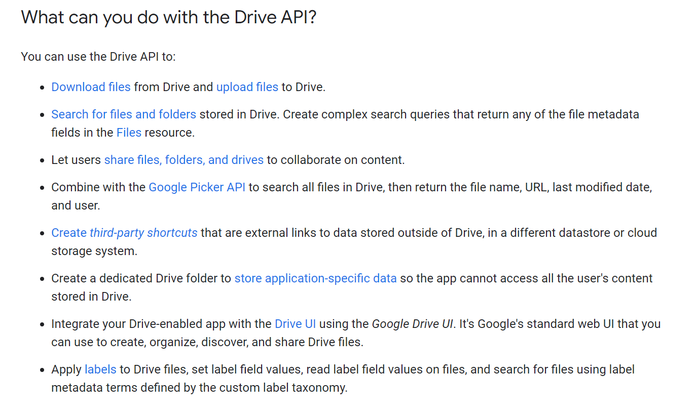
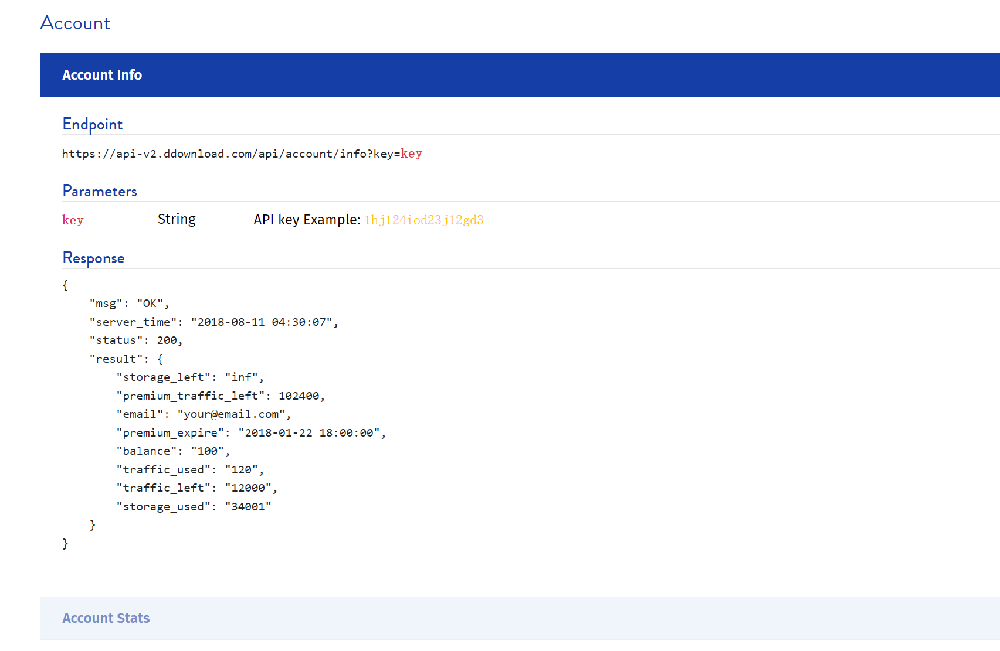
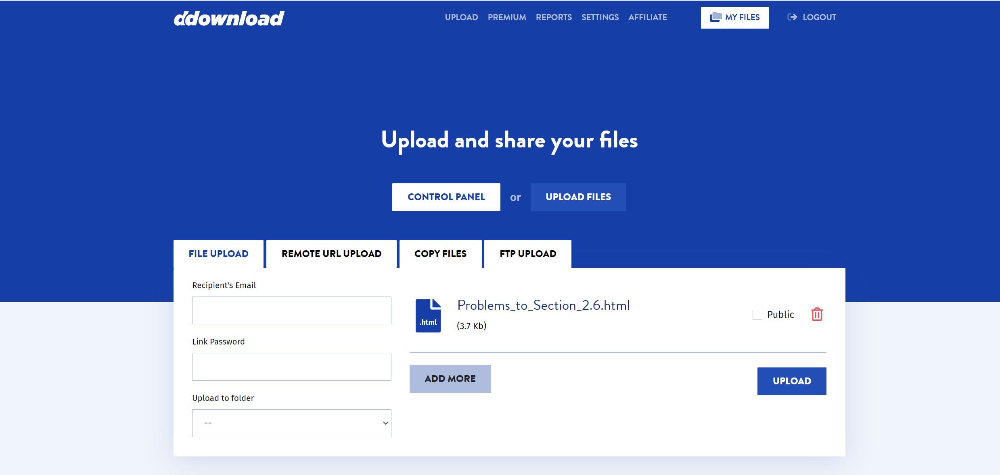
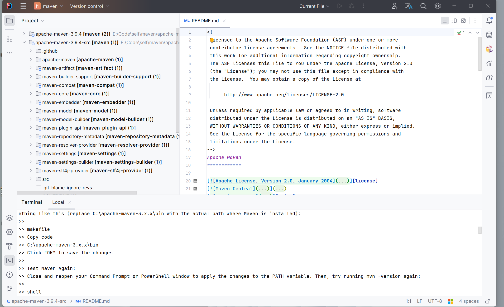
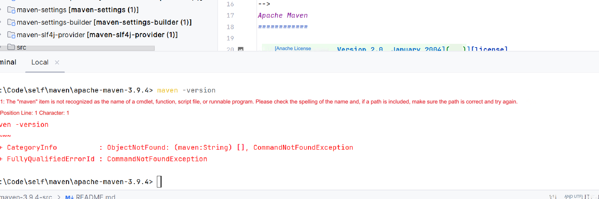
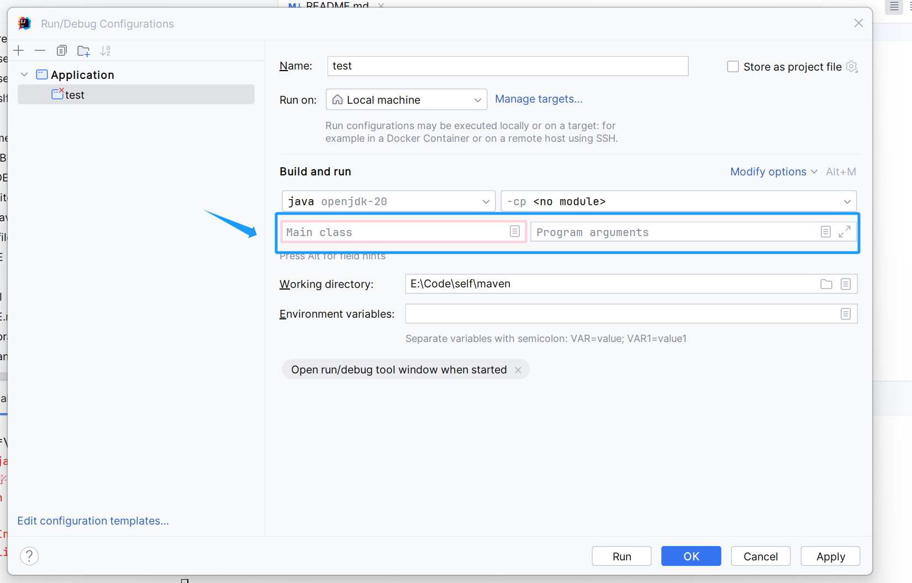

# CS207 Project API
Group 13 - TUT0101 - BA3175

Team Members: Agnes Yau, Emily Tieu, Nanxin Wang, Yunhan Jin

## Problem Domain:
### Note-Taking Application
Our group will focus on creating a note-taking application with an integrated text editor.

## Description of Application:
These are some of the key features we hope to implement:

#### 1. Sections and Pages
Users will be able to organise their notes into different sections and pages, allowing structured and easy navigation.
#### 2. API Integration
Integrating API will enhance the application's functionality, enabling features such as collaborative editing.
#### 3. UI for Creating Notes
We believe a user-friendly interface for note-taking is essential, we hope users find it simple to use the application.
#### 4. Display Formatting Options
Users will be able to insert images, change sizes, and create visually appealing notes with a variety of options.
#### 5. Export and Import
Users can import notes from other sources and also export their written notes to different formats (e.g. PDF, images).
#### 6. Text Entry
Other than handwriting-notes, users can choose to type and edit text within the application by using a keyboard.
#### 7. Support for Multiple Languages
This feature will allow the note-taking application to be accessible to a diverse user base.
#### 8. Spell Checking
This feature will perform real-time spell checks as users write their notes. This will help users to identify errors, enhancing the quality of their notes.
#### 9. Save and Load
Users will be able to save their notes at anytime and can load their previous work when they wish to continue where they left off, enabling features like real-time data retrieval.

## API Link:
Below are some of the APIs we think that might be useful to use that are related to our domain:

Evernote API：
https://dev.evernote.com/doc/
https://github.com/evernote/evernote-sdk-java 

Google Docs API:
https://developers.google.com/docs/api 

Microsoft OneNote API:
https://dev.onenote.com/docs 

Google Drive API:
https://developers.google.com/drive/api/guides/about-sdk

ddownload API:
https://ddownload.com/api 

spelling check API:
https://github.com/languagetool-org/languagetool

## Screenshot of Trying Out API:

## Example Output of Running our Java Code:
We attempted the API of Evernote and Outlook, however we encountered few problems during our attempts. 

### Example of using Drive API-
Here are some of our findings:
1. Google Drive provides a platform on which we can upload our files.
 
2. ddowload provides the API on their website which provides us some ideas on how to structure our cloud drive.

### Example of Spelling-Correction Attempts-

* This shows that the supporting package (Maven) will be needed, and should be added to the environment. 

* This shows our attempt to add jdk manually to the project, however, we are not sure how to fill these blanks

* This shows the total API given

## A list of any technical problems blocking progress:
1. Limited Authority and Time:

We tried to get the access_token from OneNote, however we are not authorised to use it. 

We believe that with more time, we will be able to find a solution to this problem.
2. Problems with Environment Settings: This is documented under "Example of spelling-correction attempts".
At the moment, we are not able to add Maven as a package as the built-in IntelliJ Java jdk does not provide this environment path.

